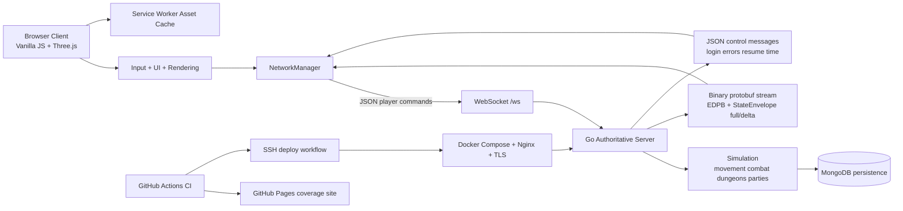

# EIDOLON

[](https://github.com/aeml/eidolon/actions/workflows/ci.yml)
[](https://eidolon.mendola.tech/coverage/)

> Proyecto de [Robert Mendola](https://mendola.tech)

## Descripción general

Eidolon es un proyecto de arquitectura de sistemas y un RPG de acción multijugador en tiempo real para navegador. El cliente es una aplicación para navegador escrita en JavaScript puro + Three.js, mientras que el backend es un servidor de juego en Go con autoridad central que gestiona la simulación, la red y la persistencia.

Para fines de portafolio, el repositorio debe entenderse mejor como un proyecto de sistemas full-stack en tiempo real con un frontend de videojuego:

- el cliente para navegador y el servidor están claramente separados
- el estado del juego es administrado por el servidor, sin confiar en el cliente
- los clientes se comunican mediante WebSockets
- el servidor transmite el estado con mensajes protobuf `StateEnvelope` utilizando encapsulamiento de trama `EDPB`
- MongoDB respalda los datos persistentes de personajes y sistemas sociales
- el despliegue incluye Docker, MongoDB, Nginx y automatización de TLS

## Enfoque de Ingeniería

Este proyecto demuestra trabajo de ingeniería de backend y sistemas en un entorno interactivo en tiempo real:

- Simulación con autoridad en el servidor: el movimiento, combate, progreso en mazmorras, recompensas, flujos de grupo y comportamiento de reconexión se aplican y validan en el servidor Go.
- Comunicación en tiempo real: el navegador envía las intenciones del jugador mediante WebSockets, mientras el servidor transmite actualizaciones completas y de delta del estado a los clientes.
- Diseño de protocolo: el runtime utiliza un modelo de transporte mixto con mensajes de comando en JSON y replicación binaria de estado en protobuf.
- Sincronización: la base de código incluye trabajo de predicción/amuadamiento en el cliente, replicación de entidades remotas, reconexión/reanudación de sesión y gestión del estado de conexión.
- Persistencia: MongoDB se utiliza para datos de juego persistentes, con pruebas sobre persistencia de grupos y rutas de reanudación de sesión ya incluidas en el repositorio.
- Separación de responsabilidades: el cliente gestiona renderizado, entrada, HUD y presentación; el servidor gestiona simulación, autoridad, validación y estado canónico.
- Despliegue y operaciones: el repositorio incluye empaquetado del servidor con Docker, Docker Compose para app + Mongo, configuración de proxy inverso con Nginx y scripts de aprovisionamiento TLS.
- Dirección de arquitectura escalable: la hoja de ruta actual enfatiza la descomposición de módulos runtime de gran tamaño, endurecimiento del protocolo, endurecimiento de la persistencia y validación de carga sostenida multijugador.

## Características Actuales

- Gameplay de RPG de acción multijugador en tiempo real con cuatro clases de jugador: Fighter, Rogue, Wizard y Cleric.
- Movimiento, combate, habilidades, salto, entrada a mazmorras y flujo de recompensas con autoridad en el servidor.
- Cuatro reinos del mundo exterior más una ciudad, y cuatro mazmorras instanciadas.
- Sistemas sociales y de progreso persistentes que incluyen grupos, estados sociales, amistades, almacenamiento, fragua, misiones y características de la casa de trueque.
- Flujo de reconexión y reanudación de sesión con retransmisión exponencial en el cliente y gestión de tokens de reanudación en el servidor.
- Transmisión de estado completo/delta en protobuf para replicación de entidades.
- Caching de activos del lado del navegador mediante un service worker.
- Cobertura de pruebas en cliente y servidor en CI, con informes de cobertura publicados en GitHub Pages.

## Arquitectura



Propiedad central del runtime:

- `src/core/GameEngine.js`: ciclo principal del runtime del cliente y aplicación del estado con autoridad.
- `src/core/NetworkManager.js`: ciclo de vida WebSocket, envíos JSON, decodificación protobuf, reconexión y manejo de reanudación.
- `src/core/RenderSystem.js`: renderizado, cámaras, escenas y presentación visual.
- `src/core/AbilityController.js`: orquestación local de habilidades y selección de objetivos.
- `server/main.go`: servidor WebSocket, manejo de mensajes, flujo de protocolo y pipeline de difusión de estado.
- `server/internal/game/world.go`: simulación de mundo con autoridad y reglas de gameplay.
- `server/internal/database/`: capa de persistencia que respalda datos de runtime almacenados.
- `server/deploy/`: scripts de despliegue Docker, Compose, restauración, Nginx y TLS.

El patrón más relevante para el backend en el repositorio es la división entre la intención del cliente y la propiedad del estado por parte del servidor. El navegador envía acciones como `move`, `jump`, `attack`, `ability`, `party_*` y `resume_session`; el servidor valida y aplica esas acciones, y luego repubica el estado canónico del mundo a todos los clientes conectados.

## Pila Tecnológica

| Capa | Tecnología |
|-------|------------|
| Cliente | Módulos ES JavaScript puro, Three.js `0.181.2` |
| Red | WebSockets |
| Protocolo de Estado | Mensajes de comando JSON, replicación protobuf `StateEnvelope` con encapsulamiento `EDPB` |
| Servidor | Go `1.24.5`, Gorilla WebSocket, protobuf |
| Persistencia | MongoDB |
| Entrega de Activos | Archivos estáticos del cliente, caching con service worker |
| Despliegue | Docker, Docker Compose, Nginx, scripts Certbot TLS |
| QA de Navegador | Playwright `1.61.1`; Chrome del sistema para gameplay de personaje y Chromium fijado para CI anónimo alojado |
| Validación | Jest, ESLint, Playwright, `go test`, `go build`, auditoría npm, GitHub Actions |

## Desarrollo Local

### Prerrequisitos

- Node.js `24` (la línea de versión soportada) y npm `9+`
- Go `1.24.5`
- MongoDB

### Ejecutar el Servidor

Desde `server/`:

```bash
go run .
```

Endpoint local predeterminado de WebSocket:

- `ws://localhost:8080/ws`

### Ejecutar el Cliente

Desde la raíz del repositorio:

```bash
npm ci
npm run serve
```

Abrir:

- `http://127.0.0.1:4173`

Si deseas que el cliente para navegador se conecte al servidor local en lugar del endpoint de producción, actualiza la dirección del servidor configurada en `index.html` como parte de tu flujo de trabajo local.

### Ruta de Despliegue Local

El repositorio también incluye una ruta de servidor orientada al despliegue bajo `server/`:

```bash
cp .env.example .env
docker compose build api
docker compose up -d
```

Para despliegue en hosts Linux, consulta `server/deploy/README_LINUX.md`.

## Pruebas y Construcción

Validación del cliente desde la raíz del repositorio:

```bash
npm ci
npm test
npm run lint
npm audit --audit-level=low
npm run docs:animations
npm run test:e2e:anonymous
```

Subconjunto opcional de pruebas rápidas:

```bash
npm run test:smoke
```

QA completa aislada de personajes y animaciones (requiere Docker y Chrome del sistema con aceleración por hardware):

```bash
sg render -c 'npm run verify:browser-gpu'
sg render -c 'npm run test:e2e:animations'
sg render -c 'EIDOLON_ISOLATED_QA_ROUTE=movement npm run test:e2e:isolated'
sg render -c 'npm run test:e2e:isolated'
```

La galería determinista renderiza cada presentación canónica base/runa y cada entrada de inventario de actor en calidad Alta y Baja a través del código de renderizado de producción. La ruta de movimiento utiliza entrada real de ratón y muestreo por fotogramas de comportamiento exacto, sub-llegada, cercano, sostenido, seguimiento de cámara, reconocimiento y corrección. La ruta aislada construye una imagen temporal de servidor por ejecución, crea contenedores Mongo/API con sufijos únicos, una red privada y personajes descartables en lista blanca. Ejecuta las rutas generales de personaje y movimiento, las matrices de locomoción/muerte y habilidad/runa de las cuatro clases, y la matriz de animación/remota/movimiento entre dos navegadores a través de entrada visible, luego elimina solo los recursos que creó. Rechaza colisiones de recursos o puertos ocupados; sobrescribe el puerto predeterminado con `EIDOLON_ISOLATED_QA_PORT`.

El inventario canónico generado es [docs/ANIMATION_COVERAGE.md](docs/ANIMATION_COVERAGE.md). Edita sus manifiestos de origen y regenera el archivo; no edites sus tablas manualmente.

Validación del servidor desde `server/`:

```bash
go test -race ./...
go build -trimpath ./...
```

Notas:

- `npm ci` ejecuta `prepare:client`, que copia los runtimes bloqueados de Three.js y protobuf desde `node_modules` hacia `vendor/` (ignorado). La producción ya no depende de un CDN de runtime.
- El cliente para navegador permanece como módulos ES estáticos; no hay bundle de aplicación.
- Las ejecuciones end-to-end locales pueden apuntar el servidor estático de solo pruebas a un backend aislado con `EIDOLON_E2E_WS_URL=ws://127.0.0.1:<port>/ws`; el HTML de producción nunca se reescribe.
- El QA de navegador con credenciales utiliza `EIDOLON_E2E_USERNAME` y `EIDOLON_E2E_PASSWORD`. Establece `EIDOLON_E2E_FULL_GAMEPLAY=1` solo para un personaje dedicado de QA que pueda subir nivel, combatir, saquear y entrar a mazmorras. Las variables opcionales `_SECONDARY` habilitan la ruta de dos navegadores.
- Las trazas, capturas de pantalla y videos de Playwright con credenciales están deshabilitados para que los identificadores de cuenta e inputs de formularios no ingresen a los artefactos. La instantánea automática de fallo con valor de input de Playwright también está deshabilitada para rutas con credenciales, y CI enmascara y escanea los valores de credenciales proporcionados antes de subirlos. La ruta anónima conserva capturas, trazas y video en caso de fallo.

### Verificación de lanzamiento

- Identidad del cliente: `https://eidolon.mendola.tech/release.json`
- Listo e identidad del servidor: `https://eserver.mendola.tech/healthz`
- Ambos endpoints reportan el commit Git desplegado. El flujo de trabajo de despliegue sondea hasta que coinciden con el SHA empujado, luego ejecuta la suite Playwright en vivo.
- `/level`, `/qa-waypoint <combat|encounter|verdant>`, `/qa-loot-next`, `/qa-disconnect`, `/qa-animation-ready [low-health|persistent]` y `/qa-protection off` son comandos de QA de lanzamiento. Están deshabilitados a menos que el nombre de usuario autenticado aparezca en la lista blanca `EIDOLON_QA_USERNAMES` del servidor. El waypoint de encuentro elige al enemigo del mundo exterior en vivo más cercano al anclaje de combate fijo y coloca solo al personaje de QA a ocho metros hacia ese anclaje; no genera ni muta al enemigo y no acepta coordenadas. La preparación de animación restaura recursos/tiempos de enfriamiento acotados; `low-health` permite la ruta de input de Última Resistencia, y `persistent` extiende solo la próxima activación/mejora de Spirit Guardians lo suficiente para probar la reconstrucción de unión tardía. La protección solo puede desactivarse después de un waypoint de QA acotado para que la muerte/reaparición permanezca como gameplay real con autoridad en el servidor.

## Estado del Proyecto

- Versión mostrada en juego actual: `Alpha 0.40.0`
- Línea de implementación activa: descomposición de arquitectura `0.40`
- Fundamentos entregados actualmente: cuatro clases, cuatro reinos, cuatro mazmorras, combate multijugador con autoridad, misiones, botín, fragua, almacenamiento, casa de trueque, grupos, estados sociales, amigos/estado de presencia, reconexión/reanudación de sesión, caching de activos, base de audio y pulido sustancial de UX
- Énfasis de ingeniería actual: reducir puntos críticos del monolito en `server/internal/game/world.go`, `server/main.go`, `src/core/GameEngine.js` y `src/ui/UIManager.js`
- Próximos temas de endurecimiento orientados al backend en la hoja de ruta: persistencia, seguridad del protocolo, rendimiento, cobertura multicliente y validación de carga sostenida

Estado de verificación a partir del 20 de julio de 2026:

- Implementado y probado con unit tests: runtimes de navegador bloqueados/autoalojados, autorización de comandos de QA, cobertura canónica para 52 habilidades activas, 60 variantes de runa y 47 arquetipos de actor, replicación persistente de estado de animación, credenciales de prueba descartables, identidad de salud/lanzamiento y puertas SHA de despliegue.
- Probado en navegador localmente: movimiento local exacto/sub-llegada/cercano/sostenido, coherencia de cámara, reconocimiento ordenado e interpolación remota con marca de tiempo de dos procesos; la galería de animación determinista Alta/Baja; matrices de clase de entrada real que cubren locomoción/ataque básico/muerte y cada habilidad/runa canónica; VFX remoto incluyendo unión tardía/expiración de Spirit Guardians; y rutas de personaje descartable anónimas/generales en Chrome del sistema con aceleración por hardware.
- Probado en producción en vivo: el SHA desplegado `2d8dc3a` pasó la superficie anónima, midió movimiento exacto/sub-llegada/corto/sostenido con límites de cámara y reconciliación, menús de personaje persistente/reconexión, combate/saqueo/mazmorra/persistencia extendidos, cada matriz de habilidad/runa y locomoción/muerte de las cuatro clases, e interpolación de suelo, salto y combate entre dos clientes en el mismo búfer, más el ciclo de vida remoto de Spirit Guardians en Chrome del sistema con aceleración por hardware. La ejecución de GitHub Actions `29766780968` no tuvo reintentos de Playwright ni fallos de producto.
- El registro completo de evidencia y el enlace al flujo de trabajo se conservan en `docs/plans/live-browser-qa-checklist.md`.

Puntos críticos medidos actualmente (líneas físicas, `wc -l`):

| Archivo | LOC |
|---|---:|
| `server/internal/game/world.go` | 8,578 |
| `server/main.go` | 5,027 |
| `src/core/GameEngine.js` | 5,810 |
| `src/ui/UIManager.js` | 3,634 |

Estas mediciones muestran que el objetivo de descomposición `0.40` sigue abierto; el trabajo de confianza en el lanzamiento no afirma que la reducción del monolito esté completa.

## TODO de Medios

Las capturas de pantalla existentes se encuentran en `docs/media/`:

- `docs/media/gameplay-overworld.png`
- `docs/media/dungeon-run.png`

Todavía útil agregar:

- captura de combate que muestre selección de objetivo, legibilidad de daño y uso de la barra de habilidades
- captura de mazmorra que muestre guía de objetivos, estado del grupo e interfaz de resumen de recompensas
- GIF corto de gameplay que muestre movimiento, combate, botín y respuesta de menús

## Licencia

Este proyecto es de código abierto.
