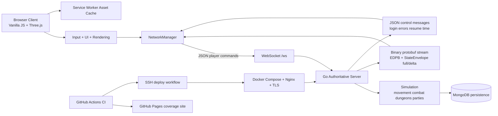

# EIDOLON

[](https://github.com/aeml/eidolon/actions/workflows/ci.yml)
[](https://eidolon.mendola.tech/coverage/)

> Project by [Robert Mendola](https://mendola.tech)

## Overview

Eidolon is a browser-based realtime multiplayer action RPG and systems architecture project. The client is a vanilla JavaScript + Three.js browser application, while the backend is an authoritative Go game server that manages simulation, networking, and persistence.

For portfolio purposes, the repo is best understood as a full-stack realtime systems project with a game front end:

- browser client and server are cleanly separated
- gameplay state is owned by the server, not trusted to the client
- clients communicate over WebSockets
- the server streams state with protobuf `StateEnvelope` messages using `EDPB` wire framing
- MongoDB backs persistent character and social data
- deployment includes Docker, MongoDB, Nginx, and TLS automation

## Engineering Focus

This project demonstrates backend and systems engineering work in a realtime interactive environment:

- Server-authoritative simulation: movement, combat, dungeon progression, rewards, party flows, and reconnect behavior are enforced on the Go server.
- Realtime communication: the browser sends player intent over WebSockets, while the server streams full and delta state updates back to clients.
- Protocol design: the runtime uses a mixed transport model with JSON command messages and binary protobuf state replication.
- Synchronization: the codebase includes client prediction/smoothing work, remote entity replication, reconnect/session resume, and connection-state handling.
- Persistence: MongoDB is used for persistent game data, with tests around party persistence and session resume paths already in the repo.
- Separation of concerns: the client owns rendering, input, HUD, and presentation; the server owns simulation, authority, validation, and canonical state.
- Deployment and operations: the repo includes Docker-based server packaging, Docker Compose for app + Mongo, Nginx reverse proxy setup, and TLS provisioning scripts.
- Scalable architecture direction: the current roadmap emphasizes decomposition of large runtime modules, protocol hardening, persistence hardening, and multiplayer soak validation.

## Current Features

- Realtime multiplayer action RPG gameplay with four player classes: Fighter, Rogue, Wizard, and Cleric.
- Server-authoritative movement, combat, abilities, jumping, dungeon entry, and reward flow.
- Four overworld realms plus town, and four instanced dungeons.
- Persistent social and progression systems including parties, social statuses, friendships, stash, forge, quests, and trading house features.
- Reconnect and session-resume flow with exponential backoff on the client and resume-token handling on the server.
- Protobuf full/delta state streaming for entity replication.
- Browser-side asset caching through a service worker.
- Client and server test coverage in CI, with coverage reports published to GitHub Pages.

## Architecture



Core runtime ownership:

- `src/core/GameEngine.js`: main client runtime loop and authoritative state application.
- `src/core/NetworkManager.js`: WebSocket lifecycle, JSON sends, protobuf decode, reconnect, and resume handling.
- `src/core/RenderSystem.js`: rendering, camera, scenes, and visual presentation.
- `src/core/AbilityController.js`: local ability orchestration and targeting.
- `server/main.go`: WebSocket server, message handling, protocol flow, and state broadcast pipeline.
- `server/internal/game/world.go`: authoritative world simulation and gameplay rules.
- `server/internal/database/`: persistence layer backing stored runtime data.
- `server/deploy/`: Docker, Compose, restore, Nginx, and TLS deployment scripts.

The most backend-relevant pattern in the repo is the split between client intent and server state ownership. The browser sends actions such as `move`, `jump`, `attack`, `ability`, `party_*`, and `resume_session`; the server validates and applies those actions, then republishes canonical world state to all connected clients.

## Tech Stack

| Layer | Technology |
|-------|------------|
| Client | Vanilla JavaScript ES modules, Three.js `0.181.2` |
| Networking | WebSockets |
| State Protocol | JSON command messages, protobuf `StateEnvelope` replication with `EDPB` framing |
| Server | Go `1.24.5`, Gorilla WebSocket, protobuf |
| Persistence | MongoDB |
| Asset Delivery | Static client files, service worker caching |
| Deployment | Docker, Docker Compose, Nginx, Certbot TLS scripts |
| Browser QA | Playwright `1.61.1`; system Chrome for character gameplay and pinned Chromium for hosted anonymous CI |
| Validation | Jest, ESLint, Playwright, `go test`, `go build`, npm audit, GitHub Actions |

## Local Development

### Prerequisites

- Node.js `24` (the supported release line) and npm `9+`
- Go `1.24.5`
- MongoDB

### Run The Server

From `server/`:

```bash
go run .
```

Default local WebSocket endpoint:

- `ws://localhost:8080/ws`

### Run The Client

From the repo root:

```bash
npm ci
npm run serve
```

Open:

- `http://127.0.0.1:4173`

If you want the browser client to connect to the local server instead of the production endpoint, update the configured server address in `index.html` as part of your local workflow.

### Local Deployment Path

The repo also includes a deployment-oriented server path under `server/`:

```bash
cp .env.example .env
docker compose build api
docker compose up -d
```

For Linux host deployment, see `server/deploy/README_LINUX.md`.

## Testing/Building

Client validation from the repo root:

```bash
npm ci
npm test
npm run lint
npm audit --audit-level=low
npm run docs:animations
npm run test:e2e:anonymous
```

Optional smoke subset:

```bash
npm run test:smoke
```

Full isolated character and animation QA (Docker and hardware-accelerated system Chrome required):

```bash
sg render -c 'npm run verify:browser-gpu'
sg render -c 'npm run test:e2e:animations'
sg render -c 'EIDOLON_ISOLATED_QA_ROUTE=movement npm run test:e2e:isolated'
sg render -c 'npm run test:e2e:isolated'
```

The deterministic gallery renders every canonical base/rune presentation and every actor inventory entry at High and Low quality through production rendering code. The movement route uses real mouse input and frame-samples exact, sub-arrival, nearby, sustained, camera-follow, acknowledgement, and correction behavior. The isolated route builds a per-run temporary server image, creates uniquely suffixed Mongo/API containers, a private network, and disposable allowlisted characters. It executes the general character and movement routes, all four class locomotion/death and ability/rune matrices, and the two-browser remote-animation/movement matrix through visible input, then removes only the resources it created. It refuses resource collisions or an occupied port; override the default port with `EIDOLON_ISOLATED_QA_PORT`.

Playwright's local static server uses port `4173` by default. Set `EIDOLON_E2E_WEB_PORT` when that port is already reserved by another service; the predeploy character gate uses dedicated port `41873`.

The generated canonical inventory is [docs/ANIMATION_COVERAGE.md](docs/ANIMATION_COVERAGE.md). Edit its source manifests and regenerate it; do not hand-edit its tables.

Server validation from `server/`:

```bash
go test -race ./...
go build -trimpath ./...
```

Notes:

- `npm ci` runs `prepare:client`, which copies locked Three.js and protobuf runtimes from `node_modules` into ignored `vendor/`. Production no longer depends on a runtime CDN.
- The browser client remains static ES modules; there is no application bundle.
- Local end-to-end runs can point the test-only static server at an isolated backend with `EIDOLON_E2E_WS_URL=ws://127.0.0.1:<port>/ws`; production HTML is never rewritten.
- Credentialed browser QA uses `EIDOLON_E2E_USERNAME` and `EIDOLON_E2E_PASSWORD`. Set `EIDOLON_E2E_FULL_GAMEPLAY=1` only for a dedicated QA character that may level, fight, loot, and enter a dungeon. Optional `_SECONDARY` variables enable the two-browser route.
- Credentialed Playwright traces, screenshots, and video are disabled so account identifiers and form inputs cannot enter artifacts. Playwright's automatic input-valued failure snapshot is also disabled for credentialed routes, and CI redacts then scans supplied credential values before upload. The anonymous route retains screenshots, traces, and video on failure.

### Release verification

- Client identity: `https://eidolon.mendola.tech/release.json`
- Server readiness and identity: `https://eserver.mendola.tech/healthz`
- Both endpoints report the deployed Git commit. The deployment workflow polls until they match the pushed SHA, then runs the live Playwright suite.
- `/level`, `/qa-waypoint <combat|encounter|verdant>`, `/qa-loot-next`, `/qa-disconnect`, `/qa-animation-ready [low-health|persistent]`, and `/qa-protection off` are release-QA commands. They are disabled unless the authenticated username appears in the server's `EIDOLON_QA_USERNAMES` allowlist. The encounter waypoint chooses the live overworld enemy nearest the fixed combat anchor and places only the QA character eight metres toward that anchor; it neither spawns nor mutates the enemy and accepts no coordinates. Animation readiness restores bounded resources/cooldowns; `low-health` permits the Last Stand input path, and `persistent` extends only the next Spirit Guardians activation/boost long enough to prove late-join reconstruction. Protection can only be turned off after a bounded QA waypoint so death/respawn remains real server-authoritative gameplay.

## Project Status

- Current in-game displayed version: `Alpha 0.41.0.22`
- Active implementation line: `0.41` procedural dark-fantasy art migration
- Current shipped foundation: four classes, four realms, four dungeons, authoritative multiplayer combat, quests, loot, forge, stash, trading house, parties, social statuses, friends/presence, reconnect/session resume, asset caching, audio foundation, and substantial UX polish
- Current engineering emphasis: reducing monolith hotspots in `server/internal/game/world.go`, `server/main.go`, `src/core/GameEngine.js`, and `src/ui/UIManager.js`
- Next backend-facing hardening themes in the roadmap: persistence, protocol safety, performance, multi-client coverage, and soak validation

Verification state as of July 20, 2026:

- Implemented and unit-tested: locked/self-hosted browser runtimes, QA command authorization, canonical coverage for 52 active abilities, 60 rune variants, and 47 actor archetypes, persistent animation-state replication, disposable test credentials, health/release identity, and deployment SHA gates.
- Locally browser-tested: exact/sub-arrival/nearby/sustained local movement, camera coherence, ordered acknowledgement, and two-process timestamped remote interpolation; the deterministic High/Low animation gallery; four real-input class matrices covering locomotion/basic attack/death and every canonical ability/rune; remote VFX including Spirit Guardians late-join/expiration; and the anonymous/general disposable character routes in hardware-accelerated system Chrome.
- Live production-tested: deployed SHA `8b74226` passed the anonymous surface, measured exact/sub-arrival/short/sustained movement with camera and reconciliation bounds, persistent-character menus/reconnect, extended combat/loot/dungeon/persistence, every four-class ability/rune and locomotion/death matrix, and same-buffer two-client ground interpolation, jump, combat, plus the remote Spirit Guardians lifecycle in hardware-accelerated system Chrome. GitHub Actions run `33620256522` passed every predeploy, deploy, identity, and live browser job.
- The full evidence record and workflow link are retained in `docs/plans/live-browser-qa-checklist.md`.

Current measured hotspots (physical lines, `wc -l`):

| File | LOC |
|---|---:|
| `server/internal/game/world.go` | 8,578 |
| `server/main.go` | 5,027 |
| `src/core/GameEngine.js` | 5,810 |
| `src/ui/UIManager.js` | 3,634 |

These measurements show that the `0.40` decomposition target is still open; release-confidence work does not claim the monolith reduction is complete.

## Media TODO

Existing screenshots live under `docs/media/`:

- `docs/media/gameplay-overworld.png`
- `docs/media/dungeon-run.png`

Still useful to add:

- combat screenshot showing targeting, damage readability, and hotbar usage
- dungeon screenshot showing objective guidance, party state, and reward summary UI
- short gameplay GIF showing movement, combat, loot, and menu responsiveness

## License

This project is open source.
