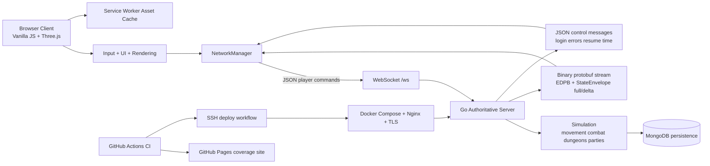

# EIDOLON

[](https://github.com/aeml/eidolon/actions/workflows/ci.yml)
[](https://eidolon.mendola.tech/coverage/)

> Project by [Robert Mendola](https://mendola.tech)

## Overview

Eidolon is a browser-based realtime multiplayer action RPG and systems architecture project. The client is a vanilla JavaScript + Three.js browser application, while the backend is an authoritative Go game server that manages simulation, networking, and persistence.

For portfolio purposes, the repo is best understood as a full-stack realtime systems project with a game front end:

- browser client and server are cleanly separated
- gameplay state is owned by the server, not trusted to the client
- clients communicate over WebSockets
- the server streams state with protobuf `StateEnvelope` messages using `EDPB` wire framing
- MongoDB backs persistent character and social data
- deployment includes Docker, MongoDB, Nginx, and TLS automation

## Engineering Focus

This project demonstrates backend and systems engineering work in a realtime interactive environment:

- Server-authoritative simulation: movement, combat, dungeon progression, rewards, party flows, and reconnect behavior are enforced on the Go server.
- Realtime communication: the browser sends player intent over WebSockets, while the server streams full and delta state updates back to clients.
- Protocol design: the runtime uses a mixed transport model with JSON command messages and binary protobuf state replication.
- Synchronization: the codebase includes client prediction/smoothing work, remote entity replication, reconnect/session resume, and connection-state handling.
- Persistence: MongoDB is used for persistent game data, with tests around party persistence and session resume paths already in the repo.
- Separation of concerns: the client owns rendering, input, HUD, and presentation; the server owns simulation, authority, validation, and canonical state.
- Deployment and operations: the repo includes Docker-based server packaging, Docker Compose for app + Mongo, Nginx reverse proxy setup, and TLS provisioning scripts.
- Scalable architecture direction: the current roadmap emphasizes decomposition of large runtime modules, protocol hardening, persistence hardening, and multiplayer soak validation.

## Current Features

- Realtime multiplayer action RPG gameplay with four player classes: Fighter, Rogue, Wizard, and Cleric.
- Server-authoritative movement, combat, abilities, jumping, dungeon entry, and reward flow.
- Four overworld realms plus town, and four instanced dungeons.
- Persistent social and progression systems including parties, social statuses, friendships, stash, forge, quests, and trading house features.
- Reconnect and session-resume flow with exponential backoff on the client and resume-token handling on the server.
- Protobuf full/delta state streaming for entity replication.
- Browser-side asset caching through a service worker.
- Client and server test coverage in CI, with coverage reports published to GitHub Pages.

## Architecture



Core runtime ownership:

- `src/core/GameEngine.js`: main client runtime loop and authoritative state application.
- `src/core/NetworkManager.js`: WebSocket lifecycle, JSON sends, protobuf decode, reconnect, and resume handling.
- `src/core/RenderSystem.js`: rendering, camera, scenes, and visual presentation.
- `src/core/AbilityController.js`: local ability orchestration and targeting.
- `server/main.go`: WebSocket server, message handling, protocol flow, and state broadcast pipeline.
- `server/internal/game/world.go`: authoritative world simulation and gameplay rules.
- `server/internal/database/`: persistence layer backing stored runtime data.
- `server/deploy/`: Docker, Compose, restore, Nginx, and TLS deployment scripts.

The most backend-relevant pattern in the repo is the split between client intent and server state ownership. The browser sends actions such as `move`, `jump`, `attack`, `ability`, `party_*`, and `resume_session`; the server validates and applies those actions, then republishes canonical world state to all connected clients.

## Tech Stack

| Layer | Technology |
|-------|------------|
| Client | Vanilla JavaScript ES modules, Three.js `0.181.2` |
| Networking | WebSockets |
| State Protocol | JSON command messages, protobuf `StateEnvelope` replication with `EDPB` framing |
| Server | Go `1.23` with `toolchain go1.24.5`, Gorilla WebSocket, protobuf |
| Persistence | MongoDB |
| Asset Delivery | Static client files, service worker caching |
| Deployment | Docker, Docker Compose, Nginx, Certbot TLS scripts |
| Validation | Jest, ESLint, `go test`, GitHub Actions |

## Local Development

### Prerequisites

- Node.js and npm
- Go `1.23+`
- MongoDB
- A simple static file server such as Python `http.server`

### Run The Server

From `server/`:

```bash
go run main.go
```

Default local WebSocket endpoint:

- `ws://localhost:8080/ws`

### Run The Client

From the repo root:

```bash
npm install
python -m http.server 8000
```

Open:

- `http://localhost:8000`

If you want the browser client to connect to the local server instead of the production endpoint, update the configured server address in `index.html` as part of your local workflow.

### Local Deployment Path

The repo also includes a deployment-oriented server path under `server/`:

```bash
cp .env.example .env
docker compose build api
docker compose up -d
```

For Linux host deployment, see `server/deploy/README_LINUX.md`.

## Testing/Building

Client validation from the repo root:

```bash
npm test
npm run lint
```

Optional smoke subset:

```bash
npm run test:smoke
```

Server validation from `server/`:

```bash
go test ./...
go build .
```

Notes:

- There is no separate frontend bundling step in `package.json`; the browser client runs as static ES modules.
- CI runs client lint/tests and server tests, then publishes coverage artifacts and a GitHub Pages coverage site.

## Project Status

- Current in-game displayed version: `Alpha 0.40.0`
- Active implementation line: `0.40` architecture decomposition
- Current shipped foundation: four classes, four realms, four dungeons, authoritative multiplayer combat, quests, loot, forge, stash, trading house, parties, social statuses, friends/presence, reconnect/session resume, asset caching, audio foundation, and substantial UX polish
- Current engineering emphasis: reducing monolith hotspots in `server/internal/game/world.go`, `server/main.go`, `src/core/GameEngine.js`, and `src/ui/UIManager.js`
- Next backend-facing hardening themes in the roadmap: persistence, protocol safety, performance, multi-client coverage, and soak validation

## Media TODO

Existing screenshots live under `docs/media/`:

- `docs/media/gameplay-overworld.png`
- `docs/media/dungeon-run.png`

Still useful to add:

- combat screenshot showing targeting, damage readability, and hotbar usage
- dungeon screenshot showing objective guidance, party state, and reward summary UI
- short gameplay GIF showing movement, combat, loot, and menu responsiveness

## License

This project is open source.
