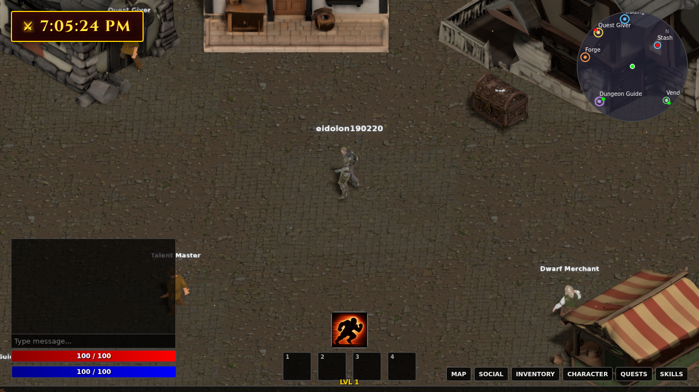
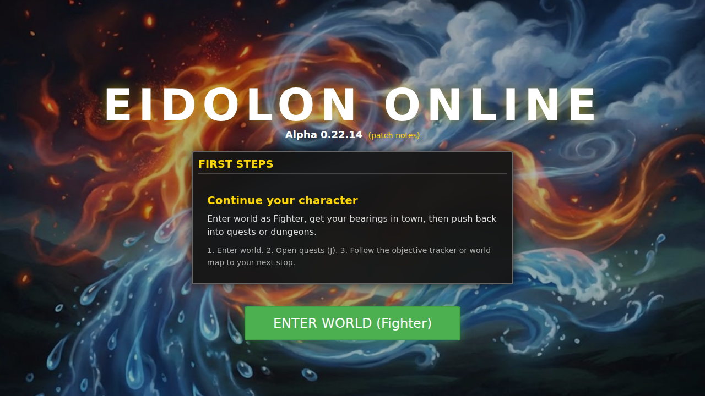
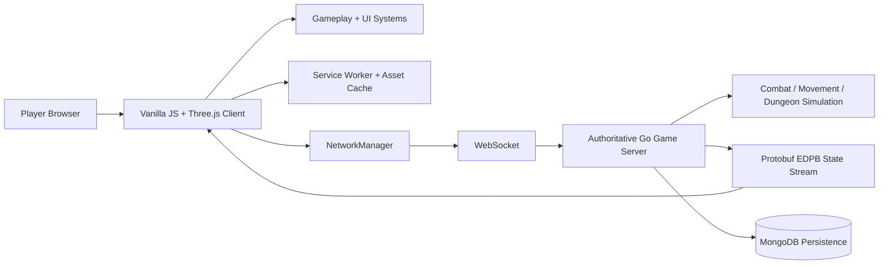

# EIDOLON

[](https://github.com/aeml/eidolon/actions/workflows/ci.yml)
[](https://eidolon.mendola.tech/coverage/)

> Brought to you by [Robert Mendola](https://mendola.tech)

Eidolon is a browser-based isometric action RPG MMO with a vanilla JavaScript + Three.js client, an authoritative Go WebSocket server, protobuf state streaming, and MongoDB persistence.

## Current State

- Current in-game displayed version: `Alpha 0.40.0`
- Active implementation line: `0.40` architecture decomposition
- Shipped foundation: 4 classes, 4 realms, 4 instanced dungeons, multiplayer combat, quests, loot, forge, stash, trading house, parties, social statuses, friends/presence, reconnect/session resume, asset caching, audio, accessibility baseline, and broad UX polish
- Current risk focus: reducing server/client monolith hotspots, strengthening multiplayer readability, then moving into richer social systems, guilds, PvP, and endgame content

## Vision

Eidolon should feel like a real online action RPG, not a promising prototype.

The end state is a polished browser MMO with strong class identity, readable and satisfying combat, authored-feeling dungeon runs, meaningful loot progression, a living economy, and a client/server architecture that stays understandable as the game grows.

Player-facing goals:
- Fast, readable, satisfying real-time combat
- Strong class fantasy across Fighter, Rogue, Wizard, and Cleric
- Dungeons with intentional pacing instead of procedural shuffling for its own sake
- Progression that stays rewarding from first login through endgame replay
- Social and economy hooks that make the world feel inhabited rather than solo with chat

Quality bar:
- Movement, attacks, jumps, abilities, hit response, and recovery feel authored
- Enemy telegraphs and player effects stay clear in chaotic fights
- Deaths feel fair and understandable
- Menus are fast, responsive, consistent, and legible
- Critical combat, dungeon, multiplayer, and UI flows have meaningful automated coverage

North star: build a browser MMO that feels shockingly complete, polished, and alive for how directly and leanly it is built.

## World And Narrative

Eidolon is set in Aethelgard, a realm where physical reality is a projection of the Collective Consciousness. The world has fallen into Dissonance: a parasitic frequency called the Umbra distorts lands and guardians into hostile forms. The player is a Harmonizer who fights to re-tune corrupted reality and reveal the ideal form, the Eidolon, beneath it.

Core restoration arc:
- Dissonance: corrupted, desaturated, hostile spaces dominated by the Umbra
- Catharsis: boss encounters against Fallen Paragons whose corruption cracks away during combat
- Resonance: restored regions become vibrant, safer, and more abundant hubs

Realm themes:
- Earth / Iron Weald: strength and growth corrupted into overgrowth, rust, and brutality
- Air / Crystalline Spire: logic and structure corrupted into cold preservation and absolute order
- Fire / Shifting Sands: possibility and spirit corrupted into mirage, deceit, and paranoia
- Water / Abyssal Well: emotion and connection corrupted into drowning grief and obsession

The fiction supports current and future systems: enemies are psychological fragments, loot is restored memory, and early greybox/low-detail presentation can be framed as reality stripped down to raw geometry by the Umbra.

Technical/narrative alignment to preserve in future content work:
- The Harmonizer maps to player control and class expression
- Dissonance/Resonance can map to corrupt/restored asset bundles or zone-state presentation
- Hollows and Constructs can justify simple repeated geometry, instancing, and elite silhouettes
- Paragon armor-break moments should read as corruption cracking away rather than simple execution
- Gear should feel like restored memories: corrupted shards refined into harmonic equipment

Base character asset prompts, retained from the original world-design notes:
- Fighter: "Low poly 3D character model of a heavy muscular human base body, standing in A-pose. Style: Stylized fantasy, hand-painted texture aesthetic. Features: Wearing simple rough-spun tunic and trousers. Earthy brown and moss green fabric colors. No armor, no helmet, no weapons. Strong, grounded silhouette. Bare hands and boots."
- Wizard: "Low poly 3D character model of a tall slender human base body, standing in A-pose. Style: Stylized fantasy, hand-painted texture aesthetic. Features: Wearing simple linen under-robes or plain tunic. Ice blue and white fabric colors. No heavy cloaks, no staff, no accessories. Clean vertical silhouette. Bare hands and soft shoes."
- Rogue: "Low poly 3D character model of an athletic wiry human base body, standing in A-pose. Style: Stylized fantasy, hand-painted texture aesthetic. Features: Wearing tight-fitting dark base layers and foot wraps. Burnt orange and deep purple fabric colors. Face visible (no cowl/hood). No daggers, no belts, no armor. Agile silhouette."
- Cleric: "Low poly 3D character model of a soft-featured human base body, standing in A-pose. Style: Stylized fantasy, hand-painted texture aesthetic. Features: Wearing a plain, unadorned gown or vestment. Deep ocean blue and teal fabric colors. No religious symbols, no staff, no heavy robes. Smooth, curved silhouette. Bare hands."

## Preview




Recommended media still to add:
- Combat screenshot: target highlight, damage readability, and hotbar usage in one frame
- Dungeon screenshot: room objective, party, and reward-summary UI in one frame
- Short GIF: movement, combat, loot, and menu polish in a 10-20 second loop

## Current Shipped Highlights

### Gameplay And Progression

- 4 playable classes: Fighter, Rogue, Wizard, Cleric
- Real-time multiplayer combat with authoritative Go server simulation
- Skill trees, passive talents, runes, combos, buffs, debuffs, and hotbar skills
- Daily quests, party play, stash, forge, gambling NPC, trading house, friends, and social presence
- Ctrl+click jump movement with authoritative sync, local prediction, remote parity work, landing dust, and camera punch support

### World And Dungeons

- Overworld realms: Earth, Water/Snow, Fire, Air, plus Town
- Instanced dungeons: Verdant Bastion Catacombs, Molten Core, Tempest Spire, Abyssal Well
- All base dungeons unlock at level 30
- Players choose dungeon run levels in bands while leveling
- Heroic and Mythic unlock at max level only
- Dungeon room state tracking, room-clear rewards, boss reward summaries, objective guidance, entrance hints, route previews, and active beat callouts

### UX And Presentation

- Combat intent HUD and target highlighting
- Quest/objective tracker and dungeon entrance context hints
- Auto-loot toggle and clearer loot pickup feedback
- Grouped buff/debuff tracker and stronger death/respawn recovery feedback
- Friend-online toast, connection-state HUD, and social status presentation
- Polished modal/menu close behavior, non-selectable window chrome, better dungeon/respec menu UX, stable shadows, and stronger landing feedback

### Technical Foundations

- Three.js `0.181.2` on runtime and tests
- Protobuf state streaming with `EDPB` envelopes
- Authoritative Go WebSocket simulation with MongoDB persistence
- Reconnect/session resume token flow and exponential-backoff client reconnect
- Jest client suite, Go server tests, and ESLint in CI/local workflows
- Modularized client systems including `NetworkManager`, `AbilityController`, `SocialPresenceController`, and extracted UI feature modules
- Client asset caching flow with per-pack status, cached-version visibility, and update actions

## Architecture At A Glance



Primary runtime ownership:
- `GameEngine`: update/render lifecycle, player state, authoritative sync, interactions, collision, loot flow, dungeon entry, transient effects
- `RenderSystem`: Three.js renderer, camera, scenes/groups, lighting, shadows, quality settings, camera punch
- `NetworkManager`: socket lifecycle, JSON sends, protobuf state decoding, message queue, reconnect state
- `AbilityController`: targeting, ability orchestration, basic attacks, hotbar abilities, pending target chase
- `UIManager` facade: shared UI wiring and feature modules including Inventory, SkillTree, Forge, Trading, Quest, and Social UI
- Server `world.go` / `internal/game`: authoritative combat, movement, dungeon logic, rewards, progression, parties, social, and state production

Current architecture work is focused on decomposition: extracting entity, talent, rune, combo, dungeon, combat, action, remote-visual-sync, jump, transient-effect, and UI modules so v1.0 features can land without compounding monolith risk.

## Controls

| Input | Action |
|-------|--------|
| Left Click | Move / Melee Attack |
| Right Click | Use Ability |
| Ctrl + Left Click | Jump toward cursor |
| 1-4 Keys | Hotbar Abilities |
| Scroll Wheel | Zoom In / Out |
| W / A / S / D | Pan Camera |
| Spacebar | Center/lock camera behavior |
| I | Inventory |
| C | Character Sheet |
| K | Skills / Talents / Runes / Combos |
| M | World Map |
| J | Quest Journal / objectives |
| O | Social / party / friends UI |
| ESC | Escape menu / close modal UI |

## Tech Stack

| Layer | Technology |
|-------|------------|
| Client | Vanilla JavaScript ES modules, Three.js `0.181.2` |
| Server | Go 1.23, `toolchain go1.24.5` in `server/go.mod`, Gorilla WebSocket, protobuf |
| Database | MongoDB |
| Assets | GLB/GLTF models, PNG textures/icons, service-worker-managed asset packs |
| Testing | Jest, ESLint, Go test |

## Local Development

### Prerequisites

- Go 1.23+
- MongoDB
- Node.js / npm
- A simple static file server such as Python's built-in `http.server`

### Run The Server

From `server/`:

```bash
cd server
go run main.go
```

Local default WebSocket endpoint:
- `ws://localhost:8080/ws`

Production endpoint commonly used by the client build:
- `wss://eserver.mendola.tech/ws`

### Run The Client

From the repo root:

```bash
npm install
python -m http.server 8000
```

Then open:
- `http://localhost:8000`

If you want the local client to connect to the local server instead of production, update the hidden server address in `index.html` or use your local dev workflow for that environment.

## Tests And Validation

From the repo root:

```bash
npm test
npm run lint
```

Fast smoke subset:

```bash
npm run test:smoke
```

From `server/`:

```bash
go test ./...
```

## Project Layout

```text
eidolon/
├── index.html
├── src/
│   ├── main.js
│   ├── core/
│   │   ├── GameEngine.js
│   │   ├── RenderSystem.js
│   │   ├── NetworkManager.js
│   │   ├── AbilityController.js
│   │   ├── InputManager.js
│   │   ├── ChunkManager.js
│   │   └── CollisionManager.js
│   ├── ui/
│   ├── world/
│   ├── entities/
│   ├── skills/
│   └── utils/
├── server/
│   ├── main.go
│   ├── internal/game/
│   ├── internal/database/
│   └── deploy/
├── docs/
├── tests/
└── assets/
```

## Documentation Policy

Root documentation is intentionally limited to:
- `README.md`: current product, technical, setup, architecture, and world summary
- `ROADMAP.md`: current roadmap and planning source of truth

Additional working plans and snapshots live under `docs/`, especially `docs/plans/`. Per-patch history lives in `index.html` Patch Notes.

## License

This project is open source.
